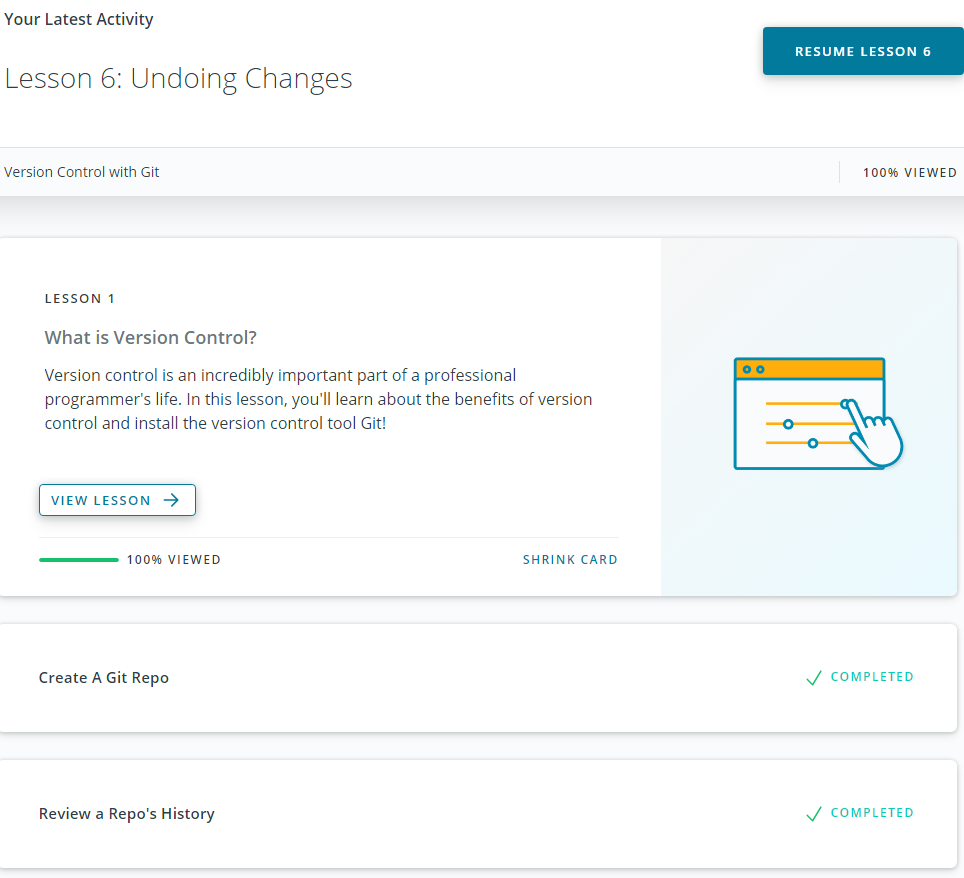
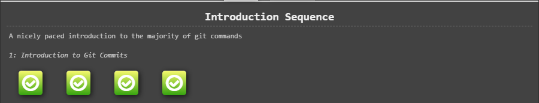
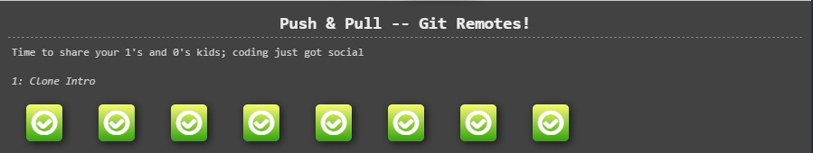
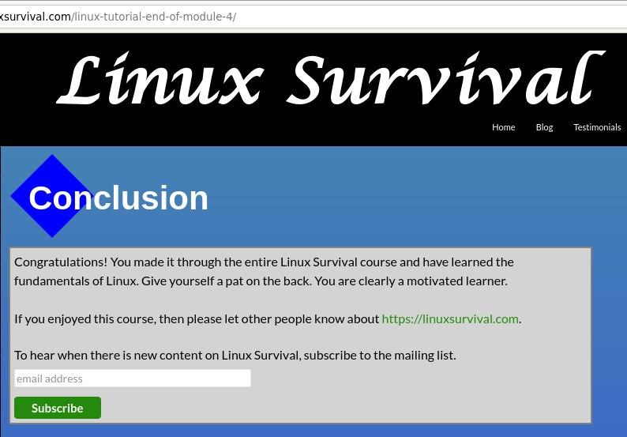

# General
## Git Basics
I'm a total newbie here (except html course at school) and I've never used Git before and had some struggles, but with the help of Google was able to find all the answers to my questions.
Udacity course was pretty convenient for me, I found learngitbranching more confusing tbh, but then I understood the logic.

### Version Control with Git

### Learn Git Branching

## Linux CLI, and HTTP
### Linux Survival (4 modules)

Almost everything was new for me in this module, so it was nice to find familiar commands from the previous block. I enjoyed reading about connection handling, identification and authentication and caching in the HTTP part 2. I intend to learn more about the HTTP protocol.