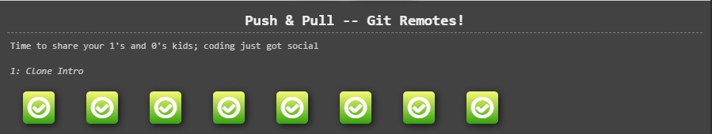
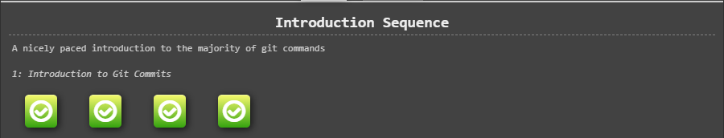
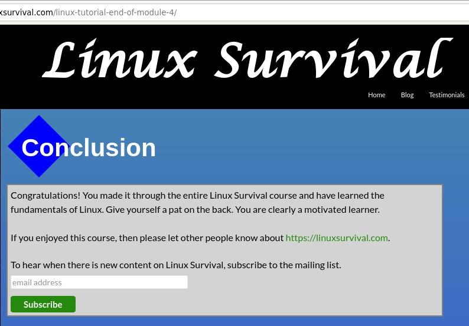
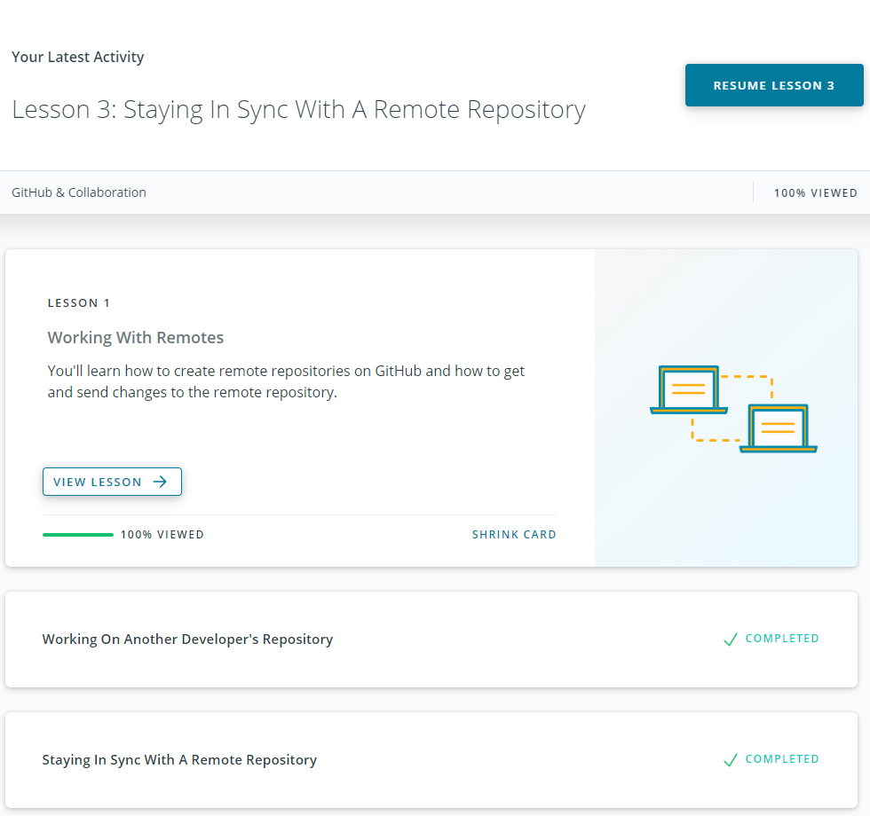
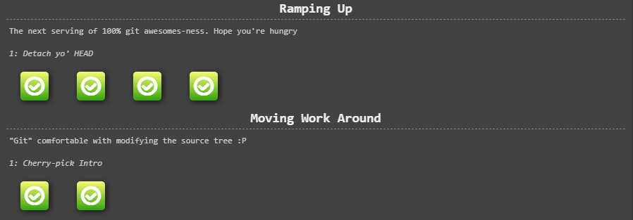
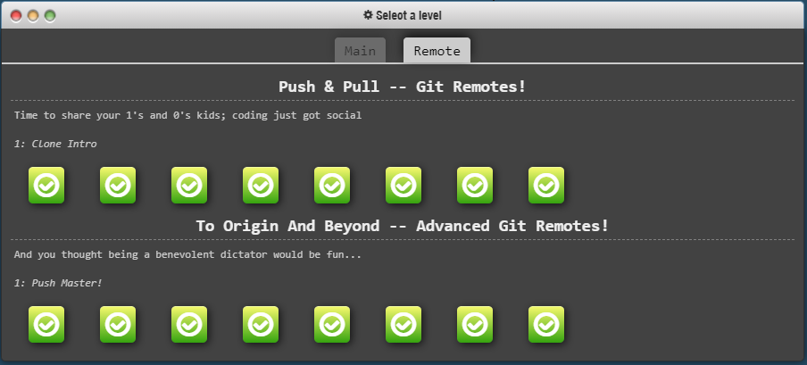
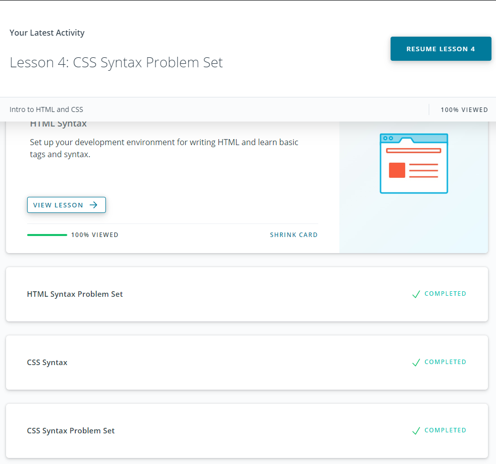
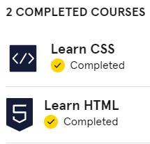
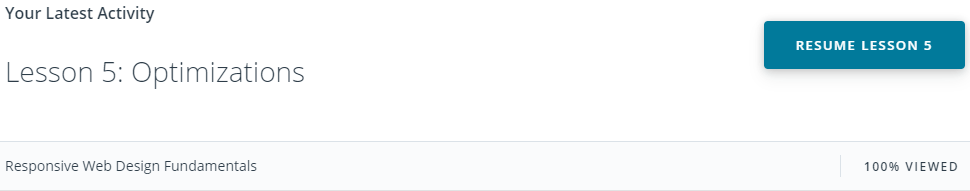
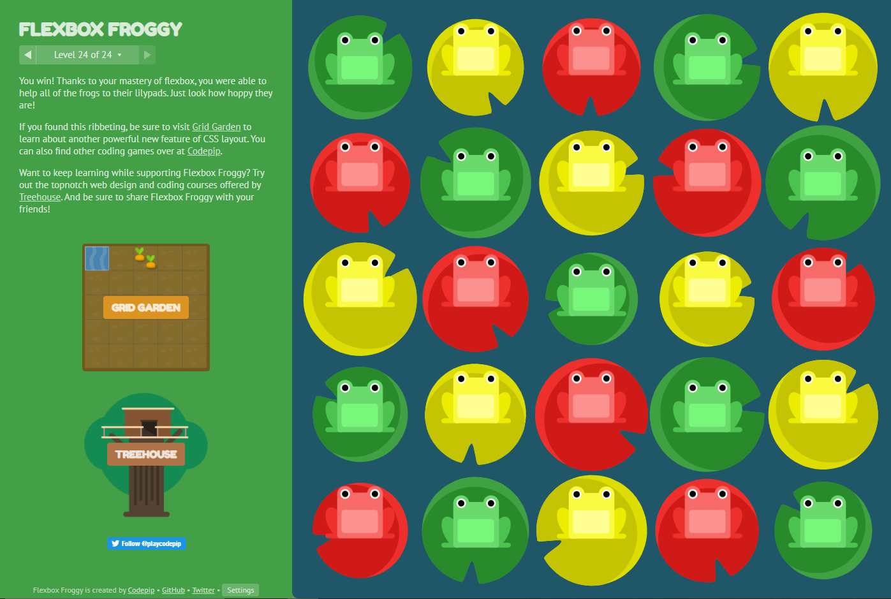

# General
## Git Basics
I'm a total newbie here (except html course at school) and I've never used Git before and had some struggles, but with the help of Google was able to find all the answers to my questions.
Udacity course was pretty convenient for me, I found learngitbranching more confusing tbh, but then I understood the logic.

### Version Control with Git

### Learn Git Branching

## Linux CLI, and HTTP
### Linux Survival (4 modules)

Almost everything was new for me in this module, so it was nice to find familiar commands from the previous block. I enjoyed reading about connection handling, identification and authentication and caching in the HTTP part 2. I intend to learn more about the HTTP protocol.

## Git Collaboration
### GitHub & Collaboration

### Main: Ramping Up, Moving Work Around

### Remote: To Origin and Beyond

It was pretty hard to learn some concepts, but I hope in practice many things will be understood better, especially the rebase thing. For now I will be careful.

## Intro to HTML and CSS
### Intro to HTML and CSS

### Learn HTML(Eng), Learn CSS(Eng)

I knew some basics about html and css but definitely not all that was covered in these courses.It was interesting to learn about semantics of html, sections and articles.
I was pleasantly surprised to see familiar terms from motion design (ease in, ease out etc) and I will definitely use it pretty often as it makes any animation looks analogous :). I wonder and will read later if it's possible to change the graph of this function similarly as in After Effects. Can't wait to test new knowledge in practice.

## Responsive Web Design
### Responsive Web Design Fundamentals

### Flexbox Froggy

It was a very useful part and I learned a lot of new things like the approach of building from small to big, making space for links at least 48x48 for mobile, adding a media quiery @media to several breakpoints and how to approach breakpoints in general.

## Hooli-style Popup
I thought I would die doing this practice but looks like I finally finished it! There are still many things I need to know though, but its a good start.

[DEMO](https://alyonafuria.github.io/popup/)
